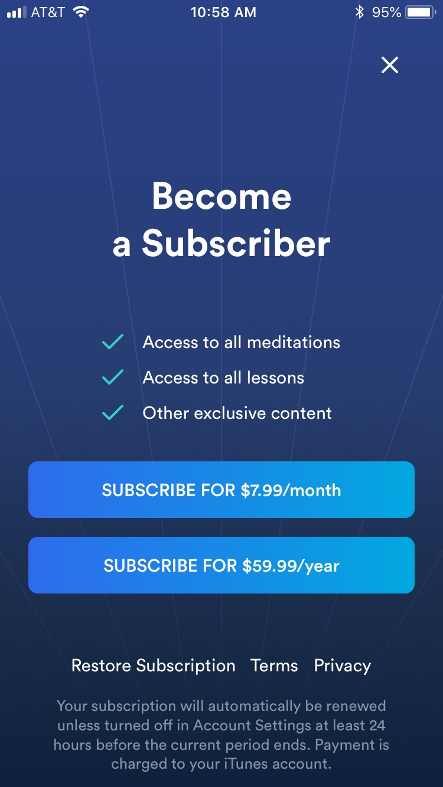
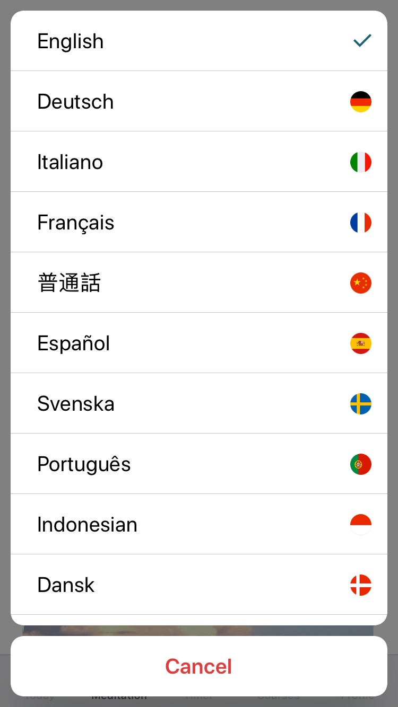
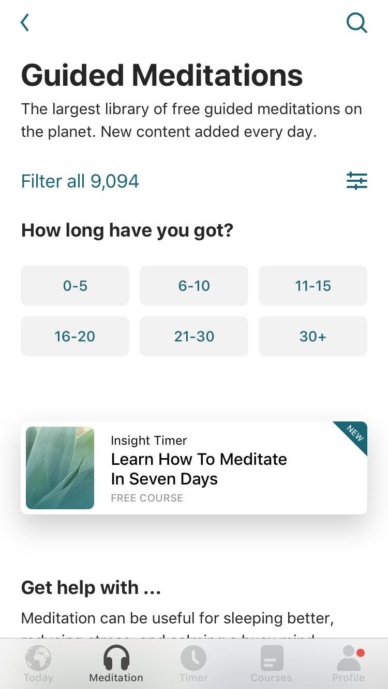
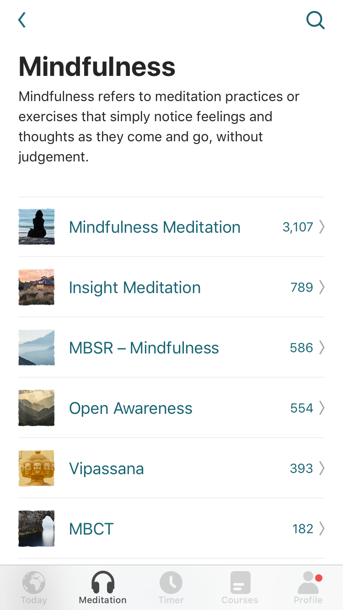
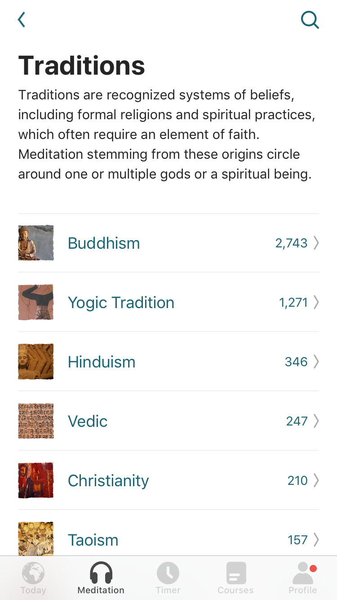
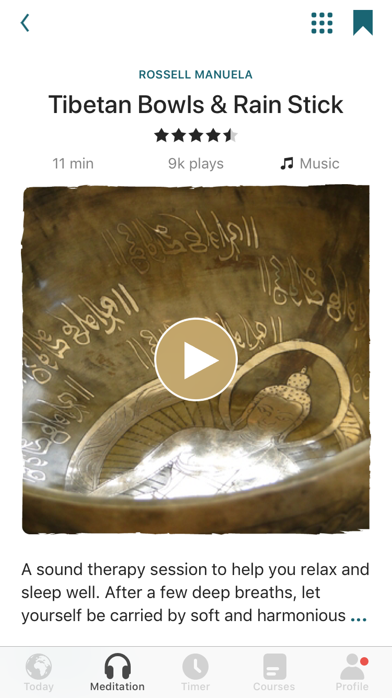
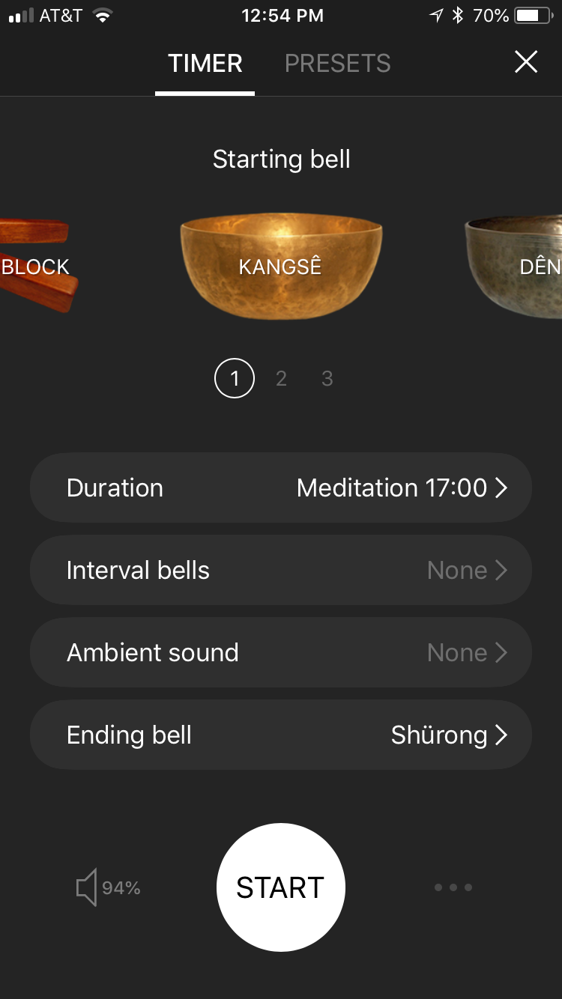
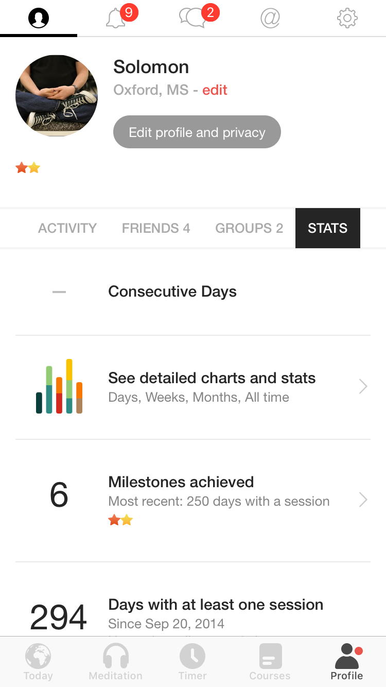

The other day, my Twitter feed informed me Penn Jillette just clocked in 1000 consecutive days of meditation using the Headspace app. Now he's considering checking out Sam Harris's new Waking Up meditation app. Sam left a congratulatory comment on Penn's tweet.

```{r echo = FALSE}
blogdown::shortcode('tweet', '1048730683940646914')
```

The whole thing was rainbows and kittens. And it reminded me to pass on some advice: **Stop using fee-based meditation apps!**

## What?

The [Headspace app](https://www.headspace.com/headspace-meditation-app) is popular and highly-rated. It's free to download and has some nice features, like reminders to meditate. However, if you want full access to its library of guided meditation audio recordings, you'll need to pay a fee at a monthly, yearly, or lifetime rate.

{width=33%}

Sam Harris's [Waking Up app](https://wakingup.com/home-reviews/?_ga=2.267492553.617729158.1538952176-2137086923.1448849490&utm_expid=.4j5YZcqhSKSYqCMuOBBY-A.1&utm_referrer=https%3A%2F%2Fsamharris.org%2F) app is also free to download. It's new and, in fairness, we'll have to wait and see how its format will unfold. But at present it has more of a course-type format. The free version gives you access to five guided meditations and three lessons. But if you want full access to the app's content, you also have to subscribe.

{width=33%}

I have no problem with the Headspace and Waking Up apps. They have many fine features. And I'm even a fan of a lot Harris's work. But we have a cheaper, high-quality option:

## Consider [Insight Timer](https://insighttimer.com)

{width=50%}

[Insight Timer](https://insighttimer.com) comes with a free and pay versions, too. But just download the free version. It's excellent and all you need for your meditation needs. Let me list the reasons why.

### The free library is extensive.

At the time of this writing, my free subscription to Insight Timer gives me access to some 12,000 guided meditation audios. Most of them are in English. But many are offered in other languages, such as Hebrew, Malay, and Spanish.

{width=33%}

#### Duration.

Their durations vary. The bulk of the guided meditations seem to be in the 5-to-20-minute range. But some last more than an hour.

{width=33%}

#### People and their voices.

Insight Timer's deep library boasts an impressive cast of meditation teachers. I was happy to see some familiar high-profile meditation teachers, such as Tara Brach and Joseph Goldstein. But I have also discovered new favorites, like Stephen Pende Wormland and Dawn Mauricio. To be sure, the quality of the audio recordings varies. But more importantly, they also vary in terms of vocal tone and pacing. There should be a vocal style to suit just about everyone.

{width=33%}

#### Emphasis.

I'm an academic and generally prefer meditations that are secular and connected to the clinical literature (e.g., [this recent meta-analysis](https://www.sciencedirect.com/science/article/pii/S0272735817303847?via%3Dihub)). Happily, the Insight Timer library contains offerings based on mindfulness-based stress reduction ([MBSR](https://www.umassmed.edu/cfm/mindfulness-based-programs/mbsr-courses/about-mbsr/history-of-mbsr/)) and its derivatives (e.g., [mindfulness-based cognitive therapy](http://www.mbct.com), [mindfulness-based relapse prevention](https://www.mindfulrp.com)).

{width=33%}

But you can also find meditations grounded within a number of faith traditions.

{width=33%}

#### Music.

I've focused mainly on vocally-driven meditations. However, Insight Timer also contains music/sound-based recordings. I'm partial to recordings featuring Tibetan singing bowls. 

{width=33%}

### It’s a timer, too.

Sometimes you just want a silent meditation. For those occasions, Insight Timer offers a nice timer feature. You can set it like a stopwatch to whatever duration you prefer, and choose among an array of sounds to mark the beginning and end of your sit.

{width=33%}

### It tracks.

If you go to the Profile section of the app, you'll discover it keeps track of your use and displays various summaries in attractive bar plots.

{width=33%}

[And yes, I generally agree with Richard McElreath: "The only problem with barplots is that they have bars" (2015, p. 203, [*Statistical rethinking*](https://xcelab.net/rm/statistical-rethinking/)). You can't have everything.]

## Insight Timer is great for researchers

Insight Timer allows you to download your data as a CSV file, which you can keep for yourself or email to others. Over the years, I've used the app to run group meditations within my research protocols. Since I selected the audios from the app, it allowed me to standardize the instructions across meditation sessions. Although my research assistants and I used the app on our phones to play the audios, our participants would use the timer functions on the apps on their phones to record their sessions. This gave us duplicate attendance records: one on a sign-in sheet and another on their phones. In longitudinal studies, participants could use the app on their own time and each of those sessions were recorded in the app. At the end of our studies, we were then able to download their use records as CSV files ready for pre-analysis data wrangling.

## Parting thoughts

Insight Timer has other functions, such as social networking and dharma talks. I just don't care about those things, so you can learn about them on your own. But if you're interested in learning about meditation or even if you're a veteran meditator looking for a convenient app to augment your practice with, do consider Insight Timer. There's no reason to spend your money on the alternatives before you capitalize on such a powerful resource that's available to you for free.

