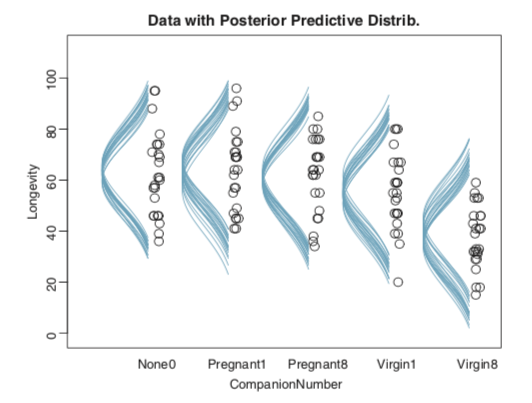

```{r set-options_13, echo = FALSE, cache = FALSE}
options(width = 100)
```

[edited Apr 21, 2021]

## tl;dr

You too can make sideways Gaussian density curves within the tidyverse. Here's how.

## Here’s the deal: I like making pictures.

Over the past several months, I've been slowly chipping away[^1] at John Kruschke's [*Doing Bayesian data analysis, Second Edition: A tutorial with R, JAGS, and Stan*](https://sites.google.com/site/doingbayesiandataanalysis/). Kruschke has a unique plotting style. One of the quirks is once in a while he likes to express the results of his analyses in plots where he shows the data alongside density curves of the model-implied data-generating distributions. Here's an example from chapter 19 (p. 563).



In this example, he has lifespan data (i.e., `Longevity`) for fruit flies from five experimental conditions (i.e., `CompanionNumber`). Those are the black circles. In this section of the chapter, he used a Gaussian multilevel model in which the mean value for `Longevity` had a grand mean in addition to random effects for the five experimental conditions. Those sideways-turned blue Gaussians are his attempt to express the model-implied data generating distributions for each group.

If you haven't gone through Kruschke's text, you should know he relies on base R and all its [loop](https://bookdown.org/rdpeng/rprogdatascience/control-structures.html#for-loops)y glory. If you carefully go through his code, you can reproduce his plots in that fashion. I'm a [tidyverse](https://www.tidyverse.org) man and prefer to avoid writing a `for()` loop at all costs. At first, I tried to work with convenience functions within ggplot2 and friends, but only had limited success. After staring long and hard at Kruschke's base code, I came up with a robust solution, which I'd like to share here.

In this post, we'll practice making sideways Gaussians in the Kruschke style. We'll do so with a simple intercept-only single-level model and then expand our approach to an intercept-only multilevel model like the one in the picture, above.

## My assumptions

For the sake of this post, I'm presuming you’re familiar with [R](https://bookdown.org/rdpeng/rprogdatascience/history-and-overview-of-r.html), aware of the [tidyverse](https://www.rstudio.com/resources/videos/data-science-in-the-tidyverse/), and have fit a [Bayesian model](https://www.youtube.com/watch?v=4WVelCswXo4) or two. Yes. I admit that's a narrow crowd. Sometimes the target's a small one.

## We need data.

First, we need data. Here we'll borrow code from Matthew Kay's nice [tutorial](https://mjskay.github.io/tidybayes/articles/tidy-brms.html) on how to use his great [tidybayes package](https://github.com/mjskay/tidybayes).

```{r, warning = F, message = F}
library(tidyverse)

set.seed(5)
n           <- 10
n_condition <- 5

abc <-
  tibble(condition = rep(letters[1:5], times = n),
         response  = rnorm(n * 5, mean = c(0, 1, 2, 1, -1), sd = 0.5))
```

The data structure looks like so.

```{r}
str(abc)
```

With Kay's code, we have `response` values for five `condition`s. All follow the normal distribution and share a common standard deviation. However, they differ in their group means.

```{r}
abc %>% 
  group_by(condition) %>% 
  summarise(mean = mean(response) %>% round(digits = 2))
```

Altogether, the data look like this.

```{r, fig.width = 6, fig.height = 2}
theme_set(theme_grey() + 
            theme(panel.grid = element_blank()))

abc %>%
  ggplot(aes(y = condition, x = response)) +
  geom_point(shape = 1)
```

Let's get ready to model.

## Just one intercept

If you've read this far, you know we're going Bayesian. Let's open up our favorite Bayesian modeling package, Bürkner's [brms](https://github.com/paul-buerkner/brms).

```{r, warning = F, message = F}
library(brms)
```

For our first model, we'll ignore the groups and just estimate a grand mean and a standard deviation. Relative to the scale of the `abc` data, our priors are modestly [regularizing](https://github.com/stan-dev/stan/wiki/Prior-Choice-Recommendations).

```{r fit1, cache = T, warning = F, message = F, results = "hide"}
fit1 <- 
  brm(data = abc,
      response ~ 1,
      prior = c(prior(normal(0, 1), class = Intercept),
                prior(student_t(3, 0, 1), class = sigma)))
```

Extract the posterior draws and save them as a data frame we'll call `post`.

```{r}
post <- posterior_samples(fit1)

glimpse(post)
```

If all you want is a quick and dirty way to plot a few of the model-implied Gaussians from the simple model, you can just nest `stat_function()` within `mapply()` and tack on the original data in a `geom_jitter()`.

```{r, fig.width = 4, fig.height = 2}
# How many Gaussians would you like?
n_iter <- 20

tibble(response = c(-4, 4)) %>%
  ggplot(aes(x = response)) +
  mapply(function(mean, sd) {
    stat_function(fun   = dnorm, 
                  args  = list(mean = mean, sd = sd), 
                  alpha = 1/2, 
                  color = "steelblue")
    }, 
    # Enter means and standard deviations here
    mean = post[1:n_iter, "b_Intercept"],
    sd   = post[1:n_iter, "sigma"]
    ) +
  geom_jitter(data = abc, aes(y = -0.02),
              height = .025, shape = 1, alpha = 2/3) +
  scale_y_continuous(NULL, breaks = NULL)
```

This works pretty okay. But notice the orientation is the usual horizontal. Kruschke's Gaussians were on their sides. If we switch out our `scale_y_continuous()` line with `scale_y_reverse()` and add in `coord_flip()`, we'll have it.

```{r, fig.width = 3, fig.height = 3}
tibble(response = c(-4, 4)) %>%
  ggplot(aes(x = response)) +
  mapply(function(mean, sd) {
    stat_function(fun   = dnorm, 
                  args  = list(mean = mean, sd = sd), 
                  alpha = 1/2, 
                  color = "steelblue")
    }, 
    mean = post[1:n_iter, "b_Intercept"],
    sd   = post[1:n_iter, "sigma"]
    ) +
  geom_jitter(data = abc, aes(y = -0.02),
              height = .025, shape = 1, alpha = 2/3) +
  scale_y_reverse(NULL, breaks = NULL) +
  coord_flip() 
```

Boom. It won't always be this easy, though.

## Multiple intercepts

Since the `response` values are from a combination of five `condition` groups, we can fit a multilevel model to compute both the grand mean and the group-level deviations from the grand mean.

```{r fit2, cache = T, warning = F, message = F, results = "hide"}
fit2 <- 
  brm(data = abc,
      response ~ 1 + (1 | condition),
      prior = c(prior(normal(0, 1), class = Intercept),
                prior(student_t(3, 0, 1), class = sigma),
                prior(student_t(3, 0, 1), class = sd)),
      cores = 4)
```

"Wait. Whoa. I'm so confused"—you say. "What's a multilevel model, again?" Read this [book](https://xcelab.net/rm/statistical-rethinking/), or this [book](https://sites.google.com/site/doingbayesiandataanalysis/); start [here](https://www.youtube.com/watch?v=2sTQ7TG_85Q) on this lecture series; or even check out [my ebook](https://bookdown.org/content/3890/), starting with Chapter 12.

Once again, extract the posterior draws and save them as a data frame, `post`.

```{r}
post <- posterior_samples(fit2)

str(post)
```

This is where our task becomes difficult. Now each level of `condition` has its own mean estimate, which is a combination of the grand mean `b_Intercept` and the group-specific deviation, `r_condition[a,Intercept]` through `r_condition[e,Intercept]`. If all we wanted to do was show the model-implied Gaussians for, say, `condition == a`, that'd be a small extension of our last approach.

```{r, fig.width = 3, fig.height = 3}
tibble(response = c(-4, 4)) %>%
  ggplot(aes(x = response)) +
  mapply(function(mean, sd) {
    stat_function(fun   = dnorm, 
                  args  = list(mean = mean, sd = sd), 
                  alpha = 1/2, 
                  color = "steelblue")
    }, 
    # Here's the small extension, part a
    mean = post[1:n_iter, "b_Intercept"] + post[1:n_iter, "r_condition[a,Intercept]"],
    sd   = post[1:n_iter, "sigma"]
    ) +
  # The small extension, part b:
  geom_jitter(data = abc %>% filter(condition == "a"), aes(y = 0),
              height = .025, shape = 1, alpha = 2/3) +
  scale_y_reverse(NULL, breaks = NULL) +
  coord_flip() +
  labs(subtitle = "This is just for condition a")
```

The main thing we did was add to the definition of the `mean` within `mapply()`: `mean = post[1:n_iter, "b_Intercept"] + post[1:n_iter, "r_condition[a,Intercept]"]`. Within `geom_jitter()`, we also isolated the `condition == "a"` cases with `filter()`. Simple. However, it's more of a pickle if we want multiple densities stacked atop/next to one another within the same plot.

Unfortunately, we can't extend our `mapply(stat_function())` method to the group-level estimates--at least not that I'm aware. But there are other ways. We'll need a little help from `tidybayes::spread_draws()`, about which you can learn more [here](https://mjskay.github.io/tidybayes/articles/tidy-brms.html).

```{r, warning = F, message = F}
library(tidybayes)

sd <-
  fit2 %>% 
  spread_draws(b_Intercept, sigma, r_condition[condition,])
  
head(sd)
```

In our `sp` [tibble](https://cran.r-project.org/web/packages/tibble/vignettes/tibble.html), we have much of the same information we'd get from `brms::posterior_samples()`, but in the long format with respect to the random effects for `condition`. Also notice that each row is indexed by the chain, iteration, and draw number. Among those, `.draw` is the column that corresponds to a unique row like what we'd get from `brms::posterior_samples()`. This is the index that ranges from 1 to the number of chains multiplied by the number of post-warmup iterations (i.e., default 4000 in our case).

But we need to wrangle a bit. Within the `expand()` function, we'll select the columns we'd like to keep within the `nesting()` function and then expand the tibble by adding a sequence of `response` values ranging from -4 to 4, for each. This sets us up to use the `dnorm()` function in the next line to compute the density for each of those `response` values based on 20 unique normal distributions for each of the five `condition` groups. "Why 20?" Because we need some reasonably small number and 20's the one Kruschke tended to use in his text and because, well, we set `filter(.draw < 21)`. But choose whatever number you like.

The difficulty, however, is that all of these densities will have a minimum value of around 0 and all will be on the same basic scale. So we need a way to serially shift the density values up the y-axis in such a way that they'll be sensibly separated by group. As far as I can figure, this'll take us a couple steps. For the first step, we'll create an intermediary variable, `g`, with which we'll arbitrarily assign each of our five groups an integer index ranging from 0 to 4.

The second step is tricky. There we use our `g` integers to sequentially shift the density values up. Since our `g` value for `a == 0`, those we'll keep 0 as their baseline. As our `g` value for `b == 1`, the baseline for those will now increase by 1. And so on for the other groups. But we still need to do a little more fiddling. What we want is for the maximum values of the density estimates to be a little lower than the baselines of the ones one grouping variable up. That is, we want the maximum values for the `a` densities to fall a little bit below 1 on the y-axis. It's with the `* .75 / max(density) ` part of the code that we accomplish that task. If you want to experiment with more or less room between the top and bottom of each density, play around with increasing/decreasing that .75 value.

```{r}
sd <-
  sd %>% 
  filter(.draw < 21) %>% 
  expand(nesting(.draw, b_Intercept, sigma, condition, r_condition), 
         response = seq(from = -4, to = 4, length.out = 200)) %>%
  mutate(density = dnorm(response, mean = b_Intercept + r_condition, sd = sigma),
         g       = recode(condition,
                          a = 0,
                          b = 1,
                          c = 2,
                          d = 3,
                          e = 4)) %>% 
  mutate(density = g + density * .75 / max(density))

glimpse(sd)
```

Since we'll now be using the same axis for both the densities and the five `condition` groups, we'll need to add a `density` column to our `abc` data.

```{r}
abc <-
  abc %>% 
  mutate(density = recode(condition,
                          a = 0,
                          b = 1,
                          c = 2,
                          d = 3,
                          e = 4))
```

Time to plot.

```{r, fig.height = 4, fig.width = 4}
sd %>% 
  ggplot(aes(x = response, y = density)) +
  # here we make our density lines
  geom_line(aes(group = interaction(.draw, g)),
            alpha = 1/2, size = 1/3, color = "steelblue") +
  # use the original data for the jittered points
  geom_jitter(data = abc,
              height = .05, shape = 1, alpha = 2/3) +
  scale_y_continuous("condition",
                     breaks = 0:4,
                     labels = letters[1:5])
```

Now we're rolling. Let's make a cosmetic adjustment. Recall that the full range of the normal distribution spans from $-\infty$ to $\infty$. At a certain point, it's just not informative to show the left and right tails. If you look back up at our motivating example, you'll note Kruschke's densities stopped well before trailing off into the tails. If you look closely to the code from his text, you'll see he's just showing the inner 95-percentile range for each. To follow suit, we can compute those ranges with `qnorm()`.

```{r}
sd <-
  sd %>% 
  mutate(ll = qnorm(.025, mean = b_Intercept + r_condition, sd = sigma),
         ul = qnorm(.975, mean = b_Intercept + r_condition, sd = sigma))
```

Now we have our lower- and upper-level points for each iteration, we can limit the ranges of our Gaussians with `filter()`.

```{r, fig.height = 4, fig.width = 4}
sd %>% 
  filter(response > ll,
         response < ul) %>% 
  
  ggplot(aes(x = response, y = density)) +
  geom_line(aes(group = interaction(.draw, g)),
            alpha = 1/2, size = 1/3, color = "steelblue") +
  geom_jitter(data = abc,
              height = .05, shape = 1, alpha = 2/3) +
  scale_y_continuous("condition",
                     breaks = 0:4,
                     labels = letters[1:5])
```

Oh man, just look how sweet that is. Although I prefer our current method, another difference between it and Kruschke's example is all of his densities are the same relative height. In all our plots so far, though, the densities differ by their heights. We'll need a slight adjustment in our `sd` workflow for that. All we need to do is insert a `group_by()` statement between the two `mutate()` lines.

```{r, fig.height = 4, fig.width = 4}
sd <-
  sd %>% 
  mutate(density = dnorm(response, mean = b_Intercept + r_condition, sd = sigma),
         g       = recode(condition,
                          a = 0,
                          b = 1,
                          c = 2,
                          d = 3,
                          e = 4)) %>% 
  # here's the new line
  group_by(.draw) %>% 
  mutate(density = g + density * .75 / max(density))

# now plot
sd %>% 
  filter(response > ll,
         response < ul) %>% 
  ggplot(aes(x = response, y = density)) +
  geom_line(aes(group = interaction(.draw, g)),
            alpha = 1/2, size = 1/3, color = "steelblue") +
  geom_jitter(data = abc,
              height = .05, shape = 1, alpha = 2/3) +
  scale_y_continuous("condition",
                     breaks = 0:4,
                     labels = letters[1:5])
```

Nice. "But wait!", you say. "We wanted our Gaussians to be on their sides." We can do that in at least two ways. At this point, the quickest way is to use our `scale_y_reverse() + coord_flip()` combo from before.

```{r, fig.height = 4, fig.width = 4}
sd %>% 
  filter(response > ll,
         response < ul) %>% 
  
  ggplot(aes(x = response, y = density)) +
  geom_line(aes(group = interaction(.draw, g)),
            alpha = 1/2, size = 1/3, color = "steelblue") +
  geom_jitter(data = abc,
              height = .05, shape = 1, alpha = 2/3) +
  scale_y_reverse("condition",
                  breaks = 0:4,
                  labels = letters[1:5]) +
  coord_flip()
```

Another way to get those sideways Gaussians is to alter our `sd` data workflow. The main difference is this time we change the original `mutate(density = g + density * .75 / max(density))` line to `mutate(density = g - density * .75 / max(density))`. In case you missed it, the only difference is we changed the `+` to a `-`.

```{r}
sd <-
  sd %>% 
  # step one: starting fresh
  mutate(density = dnorm(response, mean = b_Intercept + r_condition, sd = sigma)) %>% 
  group_by(.draw) %>% 
  # step two: now SUBTRACTING density from g within the equation
  mutate(density = g - density * .75 / max(density))
```

Now in our global `aes()` statement in the plot, we put `density` on the x and `response` on the y. We need to take a few other subtle steps:

* Switch out `geom_line()` for `geom_path()` (see [here](https://ggplot2.tidyverse.org/reference/geom_path.html)).
* Drop the `height` argument within `geom_jitter()` for `width`.
* Switch out `scale_y_continuous()` for `scale_x_continuous()`.

Though totally not necessary, we'll add a little something extra by coloring the Gaussians by their means.

```{r, fig.height = 4, fig.width = 4}
sd %>% 
  filter(response > ll,
         response < ul) %>% 
  
  ggplot(aes(x = density, y = response)) +
  geom_path(aes(group = interaction(.draw, g), 
                color = b_Intercept + r_condition),
            alpha = 1/2, size = 1/3, show.legend = F) +
  geom_jitter(data = abc,
              width = .05, shape = 1, alpha = 2/3) +
  scale_x_continuous("condition",
                     breaks = 0:4,
                     labels = letters[1:5]) +
  scale_color_viridis_c(option = "A", end = .92)
```

There you have it--Kruschke-style sideways Gaussians for your model plots.

## Afterward

After releasing the initial version of this post, some of us had a lively twitter discussion on how to improve the code.

```{r echo = FALSE}
blogdown::shortcode('tweet', '1076395687020056576')
```

Part of that discussion had to do with the possibility of using functions from [Claus Wilke](https://twitter.com/ClausWilke/)'s great [ggridges package](https://github.com/clauswilke/ggridges). After some great efforts, especially from [Matthew Kay](https://twitter.com/mjskay/), we came up with solutions. In this section, we'll cover them in some detail.

First, here's a more compact way to prepare the data for the plot.

```{r}
abc %>%
  distinct(condition) %>%
  add_fitted_draws(fit2, n = 20, dpar = c("mu", "sigma")) %>% 
  mutate(lower    = qnorm(.025, mean = mu, sd = sigma),
         upper    = qnorm(.975, mean = mu, sd = sigma)) %>% 
  mutate(response = map2(lower, upper, seq, length.out = 200)) %>% 
  mutate(density  = pmap(list(response, mu, sigma), dnorm)) %>% 
  unnest() %>% 
  group_by(.draw) %>% 
  mutate(density  = density * .75 / max(density)) %>% 
  
  glimpse()
```

This could use some walking out. With the first two lines, we made a $5 \times 1$ tibble containing the five levels of `condition`, `a` through `f`. The `add_fitted_draws()` function comes from tidybayes. The first argument took our brms model fit, `fit2`. With the `n` argument, we indicated we just wanted `20` draws. With `dpar`, we requested distributional regression parameters in the output. In our case, those were the $\mu$ and $\sigma$ values for each level of `condition`. Here's what that looks like.

```{r}
abc %>%
  distinct(condition) %>%
  add_fitted_draws(fit2, n = 20, dpar = c("mu", "sigma")) %>% 
  
  head()
```

Next, we established the lower- and upper-bounds bounds for the density lines, which were 95% intervals in this example. Within the second `mutate()` function, we used the [`purrr::map2()`](https://purrr.tidyverse.org/reference/map2.html) function to feed those two values into the first two arguments of the `seq()` function. Those arguments, recall, are `from` and `to`. We then hard coded `200` into the `length.out` argument. As a result, we turned our regular old tibble into a [nested tibble](https://tidyr.tidyverse.org/reference/nest.html). In each row of our new `response` column, we now have a $200 \times 1$ data frame containing the `seq()` output. If you're new to nested data structures, I recommend checking out Hadley Wickham's [*Managing many models with R*](https://www.youtube.com/watch?v=rz3_FDVt9eg).

```{r}
abc %>%
  distinct(condition) %>%
  add_fitted_draws(fit2, n = 20, dpar = c("mu", "sigma")) %>% 
  mutate(lower    = qnorm(.025, mean = mu, sd = sigma),
         upper    = qnorm(.975, mean = mu, sd = sigma)) %>% 
  mutate(response = map2(lower, upper, seq, length.out = 200)) %>% 
  
  head()
```

Much as the `purrr::map2()` function allowed us to iterate over two arguments, the `purrr::pmap()` function will allow us to iterate over an arbitrary number of arguments. In the case of our third `mutate()` function, we'll iterate over the first three arguments of the `dnorm()` function. In case you forgot, those arguments are `x`, `mean`, and `sd`, respectively. Within our `list()`, we indicated we wanted to insert into them the `response`, `mu`, and `sigma` values. This returns the desired `density` values. Since our `map2()` and `pmap()` operations returned a nested tibble, we then followed them up with the `unnest()` function to make it easier to access the results.

Before `unnest`ing, our nested tibble had 100 observations. After `unnest()`, we converted it to the long format, resulting in $100 \times 200 = 20,000$ observations.

```{r}
abc %>%
  distinct(condition) %>%
  add_fitted_draws(fit2, n = 20, dpar = c("mu", "sigma")) %>% 
  mutate(lower    = qnorm(.025, mean = mu, sd = sigma),
         upper    = qnorm(.975, mean = mu, sd = sigma)) %>% 
  mutate(response = map2(lower, upper, seq, length.out = 200)) %>% 
  mutate(density  = pmap(list(response, mu, sigma), dnorm)) %>% 
  unnest() %>% 
  
  glimpse()
```

Hopefully, our last two lines look familiar. We `group_by(.draw)` just like in previous examples. However, our final `mutate()` line is a little simpler than in previous versions. Before we had to make that intermediary variable, `g`. Because we intend to plot these data with help from ggridges, we no longer have need for `g`. You’ll see. But the upshot is the only reason we’re adding this last `mutate()` line is to scale all the Gaussians to have the same maximum height the way Kruschke did.

```{r}
afd <-
  abc %>%
  distinct(condition) %>%
  add_fitted_draws(fit2, n = 20, dpar = c("mu", "sigma")) %>% 
  mutate(lower    = qnorm(.025, mean = mu, sd = sigma),
         upper    = qnorm(.975, mean = mu, sd = sigma)) %>% 
  mutate(response = map2(lower, upper, seq, length.out = 200)) %>% 
  mutate(density  = pmap(list(response, mu, sigma), dnorm)) %>% 
  unnest() %>% 
  group_by(.draw) %>% 
  mutate(density  = density * .75 / max(density))

glimpse(afd)
```

Let's open [ggridges](https://github.com/clauswilke/ggridges)

```{r, message = F, warning = F}
library(ggridges)
```

Note how contrary to before, we set the global y axis to our `condition` grouping variable. It's within the `geom_ridgeline()` function that we now specify `height = density`. Other than that, the main thing to point out is you might want to adjust the `ylim` parameters. Otherwise the margins aren't the best.

```{r, fig.height = 4, fig.width = 4}
afd %>%
  
  ggplot(aes(x = response, y = condition)) +
  geom_ridgeline(aes(height = density, group = interaction(condition, .draw)),
                 fill = NA, size = 1/3, color = adjustcolor("steelblue", alpha.f = 1/2)) +
  geom_jitter(data = abc,
              height = .05, shape = 1, alpha = 2/3) +
  coord_cartesian(ylim = c(1.25, 5.5))
```

"But I wanted my Gaussians tipped to the left!", you say. Yep, we can do that, too. Three things: First, we'll want to adjust  the `height` parameter to `-density`. We want our Gaussians to extend under their baselines. Along with that, we need to include `min_height = NA`. Finally, we'll switch out `coord_cartesian()` for good old `coord_flip()`. And you can adjust your `ylim` parameters as desired.

```{r, fig.height = 4, fig.width = 4}
afd %>%
  
  ggplot(aes(x = response, y = condition)) +
  geom_ridgeline(aes(height = -density, group = interaction(condition, .draw)),
                 fill = NA, size = 1/3, color = adjustcolor("steelblue", alpha.f = 1/2),
                 min_height = NA) +
  geom_jitter(data = abc,
              height = .05, shape = 1, alpha = 2/3) +
  coord_flip(ylim = c(0.5, 4.75))
```

I think it's important to note that I've never met any of the people who helped me with this project. Academic twitter, man--it's a good place to be.

## Session info

```{r}
sessionInfo()
```

```{r, echo = F}
theme_set(theme_grey())
```

[^1]: I've made a lot of progress working through Kruschke's material since the initial release of this blog post. You can find the results in an ebook, [here](https://bookdown.org/content/3686/).

