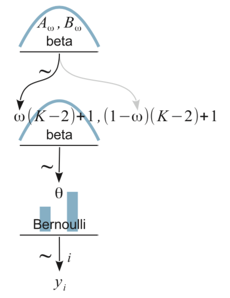

## tl;dr

You too can make model diagrams with the **tidyverse** and **patchwork** packages. Here's how.

## Diagrams can help us understand statistical models.

I've been working through John Kruschke's [*Doing Bayesian data analysis, Second Edition: A tutorial with R, JAGS, and Stan*](https://sites.google.com/site/doingbayesiandataanalysis/) and translating it into **brms** and **tidyverse**-style workflow. At this point, the bulk of the work is done and you can check it out at [https://bookdown.org/content/3686/](https://bookdown.org/content/3686/). One of Kruschke's unique contributions was the way he used diagrams to depict his statistical models. Here's an example from the text (Figure 8.2 on page 196):

{width=33%}

In the figure's caption, we read:

> Diagram of model with Bernoulli likelihood and beta prior. The pictures of the distributions are intended as stereotypical icons, and are not meant to indicate the exact forms of the distributions. Diagrams like this should be scanned from the bottom up, starting with the data $y_i$ and working upward through the likelihood function and prior distribution. Every arrow in the diagram has a corresponding line of code in a JAGS model specification.

Making diagrams like this is a bit of a challenge because even Kruchke, who is no **R** slouch, used other software to make his diagrams. In the comments section from his blog post, [*Graphical model diagrams in Doing Bayesian Data Analysis versus traditional convention*](http://doingbayesiandataanalysis.blogspot.com/2012/05/graphical-model-diagrams-in-doing.html), Kruschke remarked he made these "'by hand' in OpenOffice." If you look over to the [*How to produce John Kruschke's Bayesian model diagrams using TikZ or similar tools?*](https://tex.stackexchange.com/questions/55869/how-to-produce-john-kruschkes-bayesian-model-diagrams-using-tikz-or-similar-too) thread in StackExchange, you'll find a workflow to make plots like this with TikZ. In a related [GitHub repo](https://github.com/rasmusab/distribution_diagrams/blob/master/readme.md), the great Rasmus Bååth showed how to make diagrams like this with a combination of base **R** and [Libre Office Draw](https://www.libreoffice.org/discover/draw/).

It'd be nice, however, if one could make plots like this entirely within **R**, preferably with a **tidyverse**-style workflow. With help from the handy new [**patchwork** package](https://CRAN.R-project.org/package=patchwork), I believe we can make it work. In this post, I'll walk through a few attempts.

### My assumptions.

For the sake of this post, I'm presuming you're familiar with [**R**](https://bookdown.org/rdpeng/rprogdatascience/history-and-overview-of-r.html), aware of the [**tidyverse**](https://www.rstudio.com/resources/videos/data-science-in-the-tidyverse/), and have fit a [Bayesian model](https://www.youtube.com/watch?v=4WVelCswXo4) or two.

### Figure 8.2: Keep it simple.

One way to conceptualize Figure 8.2, above, is to break it down into discrete parts. To my mind, there are five. Starting from the top and going down, we have

* a plot of a beta density,
* an annotated arrow,
* a bar plot of Bernoulli data,
* another annotated arrow, and
* some text.

If we make and save each component separately with **ggplot2**, we can then combine them with **patchwork** syntax. First we'll load the necessary packages.

```{r, warning = F, message = F}
library(tidyverse)
library(patchwork)
library(ggforce)
```

We won't need **ggforce** for this first diagram, but it'll come in handy in the next section. Before we start making our subplots, we can use the `ggplot2::theme_set()` function to adjust the global theme.

```{r}
theme_set(theme_grey() +
            theme_void() +
            theme(plot.margin = margin(0, 5.5, 0, 5.5)))
```

Here we'll make the 5 subplots, saving them as `p1`, `p2`, and so on. Since I'm presuming a working fluency with **ggplot2** and **tidyverse** basics, I'm not going to explain the plot code in detail. If you're new to plotting like this, execute the code for a given plot line by line to see how each layer builds on the last.

```{r, fig.width = 2, fig.height = 1.25}
# plot of a beta density
p1 <-
  tibble(x = seq(from = .01, to = .99, by = .01),
         d = (dbeta(x, 2, 2)) / max(dbeta(x, 2, 2))) %>% 
  
  ggplot(aes(x = x, y = d)) +
  geom_area(fill = "skyblue", size = 0) +
  annotate(geom = "text",
           x = .5, y = .2,
           label = "beta",
           size = 7) +
  annotate(geom = "text",
           x = .5, y = .6,
           label = "italic(A)*', '*italic(B)", 
           size = 7, family = "Times", parse = TRUE) +
  scale_x_continuous(expand = c(0, 0)) +
  theme(axis.line.x = element_line(size = 0.5))

## an annotated arrow
# save our custom arrow settings
my_arrow <- arrow(angle = 20, length = unit(0.35, "cm"), type = "closed")
p2 <-
  tibble(x    = .5,
         y    = 1,
         xend = .5,
         yend = 0) %>%
  
  ggplot(aes(x = x, xend = xend,
             y = y, yend = yend)) +
  geom_segment(arrow = my_arrow) +
  annotate(geom = "text",
           x = .375, y = 1/3,
           label = "'~'",
           size = 10, family = "Times", parse = T) +
  xlim(0, 1)

# bar plot of Bernoulli data
p3 <-
  tibble(x = 0:1,
         d = (dbinom(x, size = 1, prob = .6)) / max(dbinom(x, size = 1, prob = .6))) %>% 
  
  ggplot(aes(x = x, y = d)) +
  geom_col(fill = "skyblue", width = .4) +
  annotate(geom = "text",
           x = .5, y = .2,
           label = "Bernoulli",
           size = 7) +
  annotate(geom = "text",
           x = .5, y = .94,
           label = "theta", 
           size = 7, family = "Times", parse = T) +
  xlim(-.75, 1.75) +
  theme(axis.line.x = element_line(size = 0.5))

# another annotated arrow
p4 <-
  tibble(x     = c(.375, .625),
         y     = c(1/3, 1/3),
         label = c("'~'", "italic(i)")) %>% 
  
  ggplot(aes(x = x, y = y, label = label)) +
  geom_text(size = c(10, 7), parse = T, family = "Times") +
  geom_segment(x = .5, xend = .5,
               y = 1, yend = 0,
               arrow = my_arrow) +
  xlim(0, 1)

# some text
p5 <-
  tibble(x     = 1,
         y     = .5,
         label = "italic(y[i])") %>% 
  
  ggplot(aes(x = x, y = y, label = label)) +
  geom_text(size = 7, parse = T, family = "Times") +
  xlim(0, 2)
```

Now we've saved each of the components as subplots, we can combine them with a little **patchwork** syntax.

```{r, fig.width = 2, fig.height = 3.5}
layout <- c(
  area(t = 1, b = 2, l = 1, r = 1),
  area(t = 3, b = 3, l = 1, r = 1),
  area(t = 4, b = 5, l = 1, r = 1),
  area(t = 6, b = 6, l = 1, r = 1),
  area(t = 7, b = 7, l = 1, r = 1)
)

(p1 + p2 + p3 + p4 + p5) + 
  plot_layout(design = layout) &
  ylim(0, 1)
```

For that plot, the settings in the R Markdown code chunk were `fig.width = 2, fig.height = 3.5`. An obvious difference between our plot and Kruschke's is whereas he depicted the beta density with a line, we used `geom_area()` to make the shape a solid blue. If you prefer Kruschke's approach, just use something like `geom_line()` instead.

Within some of the `annotate()` and `geom_text()` functions, above, you may have noticed we set `parse = T`. Though it wasn't always necessary, it helps streamline the workflow. I found this particularly helpful when setting the coordinates for the tildes (i.e., the $\sim$ signs).

The main thing to focus on is the **patchwork** syntax from that last code block. We combined the five subplots with the `(p1 + p2 + p3 + p4 + p5)` code. It was the `plot_layout(design = layout)` part and the associated code defining `layout` that helped us arrange the subplots in the right order and according to the desired size ratios. For each subplot, we used the `t`, `b`, `l`, and `r` parameters to define the four bounds (top, bottom, left, and right) in overall plot grid. You can learn more about how this works from Thomas Lin Pedersen's [*Controlling Layouts*](https://patchwork.data-imaginist.com/articles/guides/layout.html) and [*Specify a plotting area in a layout*](https://patchwork.data-imaginist.com/reference/area.html) vignettes.

Now we've covered the basics, it's time to build.

### Figure 9.1: Add an offset formula and some curvy lines.

For our next challenge, we'll tackle Kruschke's Figure 9.1:

{width=50%}

From a statistical perspective, this model is interesting in that it uses a hierarchical prior specification wherein the lower-level beta density is parameterized in terms $\omega$ (mode) and $K$ (concentration). From a plotting perspective, adding more density and arrow subplots isn't a big deal. But see how the $\omega(K-2)+1, (1-\omega)(K-2)+1$ formula extends way out past the right bound of that second beta density? Also, check those wavy arrows right above. These require an amended workflow. Let's go step by step. The top subplot is fairly simple.

```{r, fig.width = 2, fig.height = 1}
p1 <-
  tibble(x = seq(from = .01, to = .99, by = .01),
       d = (dbeta(x, 2, 2)) / max(dbeta(x, 2, 2))) %>% 
  ggplot(aes(x = x, y = d)) +
  geom_area(fill = "skyblue", size = 0) +
  annotate(geom = "text",
           x = .5, y = .2,
           label = "beta",
           size = 7) +
  annotate(geom = "text",
           x = .5, y = .6,
           label = "italic(A[omega])*', '*italic(B[omega])", 
           size = 7, family = "Times", parse = TRUE) +
  scale_x_continuous(expand = c(0, 0)) +
  theme(axis.line.x = element_line(size = 0.5))

p1
```

Now things get wacky.

We are going to make the formula and the wavy lies in one subplot. We can define the basic coordinates for the wavy lines with the `ggforce::geom_bspline()` function (learn more [here](https://ggforce.data-imaginist.com/reference/geom_bspline.html)). For each line segment, we just need about 5 pairs of $x$ and $y$ coordinates. There's no magic solution to these coordinates. I came to them by trial and error. As far as the formula goes, it isn't much more complicated from what we've been doing. It's all just a bunch of [plotmath syntax](https://stat.ethz.ch/R-manual/R-devel/library/grDevices/html/plotmath.html). The main deal is to notice how we set the `limits` in `the scale_x_continuous()` function to `(0, 2)`. In the other plots, those are restricted to `0, 1`.

```{r, fig.width = 4, fig.height = 1}
p2 <-
  tibble(x = c(.5, .475, .26, .08, .06,
               .5, .55, .85, 1.15, 1.2),
         y = c(1, .7, .6, .5, .2,
               1, .7, .6, .5, .2),
         line = rep(letters[2:1], each = 5)) %>% 
  
  ggplot(aes(x = x, y = y)) +
  geom_bspline(aes(color = line),
               size = 2/3, show.legend = F) + 
  annotate(geom = "text",
           x = 0, y = .125,
           label = "omega(italic(K)-2)+1*', '*(1-omega)(italic(K)-2)+1",
           size = 7, parse = T, family = "Times", hjust = 0) +
  annotate(geom = "text",
           x = 1/3, y = .7,
           label = "'~'",
           size = 10, parse = T, family = "Times") +
  scale_color_manual(values = c("grey75", "black")) +
  scale_x_continuous(expand = c(0, 0), limits = c(0, 2)) +
  ylim(0, 1) +
  theme_void()

p2
```

You'll see how this will works when we combine all the subplots, below. The rest of the subplots are similar or identical to the ones from the first section. Here we'll make them in bulk.

```{r}
# another beta density
p3 <-
  tibble(x = seq(from = .01, to = .99, by = .01),
         d = (dbeta(x, 2, 2)) / max(dbeta(x, 2, 2))) %>% 
  ggplot(aes(x = x, y = d)) +
  geom_area(fill = "skyblue", size = 0) +
  annotate(geom = "text",
           x = .5, y = .2,
           label = "beta",
           size = 7) +
  scale_x_continuous(expand = c(0, 0)) +
  theme(axis.line.x = element_line(size = 0.5))

# an annotated arrow
p4 <-
  tibble(x    = .5,
         y    = 1,
         xend = .5,
         yend = 0) %>%
  
  ggplot(aes(x = x, xend = xend,
             y = y, yend = yend)) +
  geom_segment(arrow = my_arrow) +
  annotate(geom = "text",
           x = .375, y = 1/3,
           label = "'~'",
           size = 10, family = "Times", parse = T) +
  xlim(0, 1)

# bar plot of Bernoulli data
p5 <-
  tibble(x = 0:1,
         d = (dbinom(x, size = 1, prob = .6)) / max(dbinom(x, size = 1, prob = .6))) %>% 
  
  ggplot(aes(x = x, y = d)) +
  geom_col(fill = "skyblue", width = .4) +
  annotate(geom = "text",
           x = .5, y = .2,
           label = "Bernoulli",
           size = 7) +
  annotate(geom = "text",
           x = .5, y = .94,
           label = "theta", 
           size = 7, family = "Times", parse = T) +
  xlim(-.75, 1.75) +
  theme(axis.line.x = element_line(size = 0.5))

# another annotated arrow
p6 <-
  tibble(x     = c(.375, .625),
         y     = c(1/3, 1/3),
         label = c("'~'", "italic(i)")) %>% 
  
  ggplot(aes(x = x, y = y, label = label)) +
  geom_text(size = c(10, 7), parse = T, family = "Times") +
  geom_segment(x = .5, xend = .5,
               y = 1, yend = 0,
               arrow = my_arrow) +
  xlim(0, 1)

# some text
p7 <-
  tibble(x     = .5,
         y     = .5,
         label = "italic(y[i])") %>% 
  
  ggplot(aes(x = x, y = y, label = label)) +
  geom_text(size = 7, parse = T, family = "Times") +
  xlim(0, 1)
```

Now combine the subplots with **patchwork**.

```{r, fig.width = 3.85, fig.height = 5, message = F}
layout <- c(
  area(t = 1, b = 2, l = 1, r = 1),
  area(t = 4, b = 5, l = 1, r = 1),
  area(t = 3, b = 4, l = 1, r = 2),
  area(t = 6, b = 6, l = 1, r = 1),
  area(t = 7, b = 8, l = 1, r = 1),
  area(t = 9, b = 9, l = 1, r = 1),
  area(t = 10, b = 10, l = 1, r = 1)
)

(p1 + p3 + p2 + p4 + p5 + p6 + p7) + 
  plot_layout(design = layout) &
  ylim(0, 1)
```

There are a few reasons why this worked. First, we superimposed the subplot with the formula and wavy lines (`p2`) atop of the second density (`p3`) by ordering the plots as `(p1 + p3 + p2 + p4 + p5 + p6 + p7)`. Placing one plot atop another was made easy by our use of `theme_void()`, which made the backgrounds for all the subplots transparent. But also look at how we set the `r` argument to 2 within the `area()` function for our `p2`. That's what bought us that extra space for the formula.

### Figure 9.7: Add more curvy lines and a second density to the top row.

For our next challenge, we'll tackle Kruschke's Figure 9.7:

{width=50%}

This is a mild extension of the previous one. From a plotting perspective, the noteworthy new features are we have two density plots on the top row and now we have to juggle two pairs of wiggly lines in the subplot with the formula. The two subplots in the top row are no big deal. To make the gamma density, just use the `dgamma()` function in place of `dbeta()`.

```{r, fig.width = 2, fig.height = 1}
# a beta density
p1 <-
  tibble(x = seq(from = .01, to = .99, by = .01),
         d = (dbeta(x, 2, 2)) / max(dbeta(x, 2, 2))) %>% 
  ggplot(aes(x = x, y = d)) +
  geom_area(fill = "skyblue", size = 0) +
  annotate(geom = "text",
           x = .5, y = .2,
           label = "beta",
           size = 7) +
  annotate(geom = "text",
           x = .5, y = .6,
           label = "italic(A[omega])*', '*italic(B[omega])", 
           size = 7, family = "Times", parse = TRUE) +
  scale_x_continuous(expand = c(0, 0)) +
  theme(axis.line.x = element_line(size = 0.5))

# a gamma density
p2 <-
  tibble(x = seq(from = 0, to = 5, by = .01),
         d = (dgamma(x, 1.75, .85) / max(dgamma(x, 1.75, .85)))) %>% 
  ggplot(aes(x = x, y = d)) +
  geom_area(fill = "skyblue", size = 0) +
  annotate(geom = "text",
           x = 2.5, y = .2,
           label = "gamma",
           size = 7) +
  annotate(geom = "text",
           x = 2.5, y = .6,
           label = "list(italic(S)[kappa], italic(R)[kappa])",
           size = 7, family = "Times", parse = TRUE) +
  scale_x_continuous(expand = c(0, 0)) +
  theme(axis.line.x = element_line(size = 0.5))
```

The third subplot contains our offset formula and two sets of wiggly lines.

```{r, fig.width = 4, fig.height = 1}
p3 <-
  tibble(x = c(.5, .475, .26, .08, .06,
               .5, .55, .85, 1.15, 1.175,
               1.5, 1.4, 1, .25, .2,
               1.5, 1.49, 1.445, 1.4, 1.39),
         y = c(1, .7, .6, .5, .2,
               1, .7, .6, .5, .2,
               1, .7, .6, .5, .2,
               1, .75, .6, .45, .2),
         line = rep(letters[2:1], each = 5) %>% rep(., times = 2),
         plot = rep(1:2, each = 10)) %>% 
  
  ggplot(aes(x = x, y = y, group = interaction(plot, line))) +
  geom_bspline(aes(color = line),
               size = 2/3, show.legend = F) + 
  annotate(geom = "text",
           x = 0, y = .1,
           label = "omega(kappa-2)+1*', '*(1-omega)(kappa-2)+1",
           size = 7, parse = T, family = "Times", hjust = 0) +
  annotate(geom = "text",
           x = c(1/3, 1.15), y = .7,
           label = "'~'",
           size = 10, parse = T, family = "Times") +
  scale_color_manual(values = c("grey75", "black")) +
  scale_x_continuous(expand = c(0, 0), limits = c(0, 2)) +
  ylim(0, 1)

p3
```

The rest of the subplots are similar or identical to the ones from the last section. Here we'll make them in bulk.

```{r}
# another beta density
p4 <-
  tibble(x = seq(from = .01, to = .99, by = .01),
         d = (dbeta(x, 2, 2)) / max(dbeta(x, 2, 2))) %>% 
  ggplot(aes(x = x, y = d)) +
  geom_area(fill = "skyblue", size = 0) +
  annotate(geom = "text",
           x = .5, y = .2,
           label = "beta",
           size = 7) +
  scale_x_continuous(expand = c(0, 0)) +
  theme(axis.line.x = element_line(size = 0.5))

# an annotated arrow
p5 <-
  tibble(x     = c(.375, .625),
         y     = c(1/3, 1/3),
         label = c("'~'", "italic(s)")) %>% 
  
  ggplot(aes(x = x, y = y, label = label)) +
  geom_text(size = c(10, 7), parse = T, family = "Times") +
  geom_segment(x = 0.5, xend = 0.5,
               y = 1, yend = 0,
               arrow = my_arrow) +
  xlim(0, 1)

# bar plot of Bernoulli data
p6 <-
  tibble(x = 0:1,
         d = (dbinom(x, size = 1, prob = .6)) / max(dbinom(x, size = 1, prob = .6))) %>% 
  
  ggplot(aes(x = x, y = d)) +
  geom_col(fill = "skyblue", width = .4) +
  annotate(geom = "text",
           x = .5, y = .2,
           label = "Bernoulli",
           size = 7) +
  annotate(geom = "text",
           x = .5, y = .94,
           label = "theta", 
           size = 7, family = "Times", parse = T) +
  xlim(-.75, 1.75) +
  theme(axis.line.x = element_line(size = 0.5))

# another annotated arrow
p7 <-
  tibble(x     = c(.35, .65),
         y     = c(1/3, 1/3),
         label = c("'~'", "italic(i)*'|'*italic(s)")) %>% 
  
  ggplot(aes(x = x, y = y, label = label)) +
  geom_text(size = c(10, 7), parse = T, family = "Times") +
  geom_segment(x = .5, xend = .5,
               y = 1, yend = 0,
               arrow = my_arrow) +
  xlim(0, 1)

# some text
p8 <-
  tibble(x     = .5,
         y     = .5,
         label = "italic(y[i])['|'][italic(s)]") %>% 
  
  ggplot(aes(x = x, y = y, label = label)) +
  geom_text(size = 7, parse = T, family = "Times") +
  xlim(0, 1)
```

Now combine the subplots with **patchwork**.

```{r, fig.width = 3.9, fig.height = 5, message = F}
layout <- c(
  area(t = 1, b = 2, l = 1, r = 1),
  area(t = 1, b = 2, l = 2, r = 2),
  area(t = 4, b = 5, l = 1, r = 1),
  area(t = 3, b = 4, l = 1, r = 2),
  area(t = 6, b = 6, l = 1, r = 1),
  area(t = 7, b = 8, l = 1, r = 1),
  area(t = 9, b = 9, l = 1, r = 1),
  area(t = 10, b = 10, l = 1, r = 1)
)

(p1 + p2 + p4 + p3 + p5 + p6 + p7 + p8) + 
  plot_layout(design = layout) &
  ylim(0, 1)
```

Boom; we did it!

## Limitations

Though I'm overall pleased with this workflow, it's not without limitations. To keep the values in our `area()` functions simple, we scaled the density plots to be twice the size of the arrow plots. With simple ratios like 1/2, this works well but it can be a bit of a pain with more exotic ratios. The size and proportions of the fonts are quite sensitive to the overall height and width values for the final plot. You'll find similar issues with the coordinates for the wiggly `geom_bspline()` lines. Getting these right will likely take a few iterations. Speaking of `geom_bspline()`, I'm also not happy that there doesn’t appear to be an easy way to have them end with arrow heads. Perhaps you could hack some in with another layer of `geom_segment()`.

Limitations aside, I hope this helps makes it one step easier for applied researchers to create their own Kruschke-stype model diagrams. Happy plotting!

## Session info

```{r}
sessionInfo()
```

```{r, fig.width = 2, fig.height = 1, echo = F, eval = F}
# for the real geeks, here's how to plot the density with geom_line()

tibble(x = seq(from = .02, to = .98, by = .01),
         d = (dbeta(x, 2, 2)) / max(dbeta(x, 2, 2))) %>% 
  ggplot(aes(x = x, y = d)) +
  geom_line(color = "skyblue", size = 2) +
  annotate(geom = "text",
           x = .5, y = .2,
           label = "beta",
           size = 7) +
  annotate(geom = "text",
           x = .5, y = .6,
           label = "italic(A)[omega]*', '*italic(B)[omega]", 
           size = 7, family = "Times", parse = TRUE) +
  scale_x_continuous(expand = c(0, 0), limits = c(0, 1)) +
  ylim(0, 1) +
  theme(axis.line.x = element_line(size = 0.5))
```

